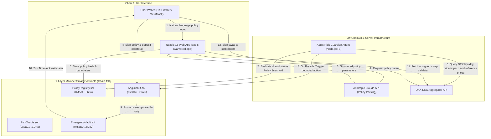

# Aegis — Non-Custodial AI Risk Guardian

> Autonomous risk protection for tokenized real-world assets (RWA) and DeFi positions on **X Layer Mainnet (Chain ID 196)** before losses compound.

[](https://aegis-rwa.vercel.app)
[-black?style=for-the-badge&logo=ethereum)](https://www.oklink.com/x-layer)
[](https://soliditylang.org/)
[](https://getfoundry.sh/)
[](https://nextjs.org/)

---

## 🛡️ Overview

Aegis allows users to deposit supported tokenized real-world assets (such as **GLDX** tokenized gold, **SPYX** tokenized S&P 500, or **USDC**) into an `AegisVault` position and define custom risk parameters in plain English:

> *"If SPYX drops more than 8% in 24 hours or oracle deviation exceeds 2%, exit 75% to USDC cautiously."*

An AI model parses plain English statements into explicit, immutable on-chain policy parameters. Once signed by the user, the off-chain **Aegis Risk Guardian** continuously monitors live market prices and DEX quotes against the registered policy parameters. If a policy breach occurs, the agent automatically executes bounded de-risking actions within strict parameters pre-authorized by the user.

---

## 📐 System Architecture



---

## 🔒 Trust Boundary & Security Model

The core product design strictly separates **autonomous guardian protection** from **user asset custody**:

1. **Autonomous & Provably Bounded**:
   - The off-chain agent can only invoke `pausePosition` or `routeToEmergency(positionId, exitBps)`.
   - `routeToEmergency` takes **no recipient parameter** and **no arbitrary calldata** — funds can strictly move only to the immutable `EmergencyVault`.
   - The exit percentage is strictly clamped by the contract to the maximum `exitPercentBps` authorized in the user's signed policy.
   - Verified by Foundry invariant fuzz test `testFuzz_AgentCannotDrainToArbitraryAddress`.

2. **Self-Custodied Swaps**:
   - Converting recovered collateral into stablecoins is performed directly by the user from the web dashboard.
   - Aegis fetches unsigned calldata from the OKX DEX aggregator; the user's own wallet signs the approval and transaction. Aegis is never the custodian, router, or recipient.

3. **Ungated Withdrawals**:
   - Manual user withdrawals from `AegisVault` are never subject to time-locks. Users can withdraw their positions at any time.

---

## ⛓️ Mainnet Smart Contract Deployments (X Layer, Chain 196)

All core smart contracts are deployed, active, and **100% source-verified on OKLink Explorer**:

| Contract | Mainnet Contract Address | Status | Block Explorer Link |
|---|---|---|---|
| **AegisVault** | `0x8066b72f9E87Ca2CFD29e41D6DEd92f6bD1aC675` | Verified ✓ | [OKLink AegisVault](https://www.oklink.com/x-layer/address/0x8066b72f9E87Ca2CFD29e41D6DEd92f6bD1aC675) |
| **EmergencyVault** | `0x55E943aeC4FB74Dd5c97a85BacddBDa4B98B5De2` | Verified ✓ | [OKLink EmergencyVault](https://www.oklink.com/x-layer/address/0x55E943aeC4FB74Dd5c97a85BacddBDa4B98B5De2) |
| **PolicyRegistry** | `0xf5c1c62bEEc5CDB4D3b596649C78f513BA5C869a` | Verified ✓ | [OKLink PolicyRegistry](https://www.oklink.com/x-layer/address/0xf5c1c62bEEc5CDB4D3b596649C78f513BA5C869a) |
| **RiskOracle** | `0x2a017C7eb8030eA7150a62Abb313cb4E358d1DA6` | Verified ✓ | [OKLink RiskOracle](https://www.oklink.com/x-layer/address/0x2a017C7eb8030eA7150a62Abb313cb4E358d1DA6) |

### Supported Real Assets on Mainnet
- **GLDX** (Tokenized Gold): `0x2380f2673c640fb67e2d6b55b44c62f0e0e69da9`
- **SPYX** (Tokenized S&P 500): `0x90a2a4c76b5d8c0bc892a69ea28aa775a8f2dd48`
- **USDC** (USD Stablecoin): `0x74b7F16337b8972027F6196A17a631aC6dE26d22`

---

## 🗺️ Product Roadmap

### 📍 Phase 1: X Layer Mainnet & Core Guardian (Q3 2026 — Live on Mainnet)
- [x] Deploy & source-verify smart contracts on X Layer Mainnet (Chain 196).
- [x] Launch natural language LLM policy parser (Anthropic Claude integration).
- [x] Deploy off-chain AI guardian monitoring engine with OKX DEX quote verification.
- [x] Launch production web dashboard deployed to Vercel ([aegis-rwa.vercel.app](https://aegis-rwa.vercel.app)).

### 📍 Phase 2: Multi-Asset Expansion & Advanced Risk Engine (Q4 2026)
- [ ] Support additional tokenized Real-World Assets (Tokenized US Treasuries, Commodities, Equities).
- [ ] Explore supplementary price-verification sources for assets with thin DEX liquidity, as a redundancy layer alongside live OKX DEX quotes.
- [ ] Add statistical rolling z-score volatility triggers for proactive position pausing before sharp market drops.
- [ ] Automated user notifications via Telegram / Email webhooks on policy breaches.

### 📍 Phase 3: Cross-Chain Expansion & Enterprise Vaults (Q1 2027)
- [ ] Expand Aegis risk guardian infrastructure to Arbitrum, Base, and OKX Web3 cross-chain bridge routes.
- [ ] Launch Multi-Sig Institutional Vaults with multi-agent consensus approvals for enterprise treasury management.
- [ ] Implement audit trail export and compliance reporting dashboard for institutional funds.

### 📍 Phase 4: Decentralized Agent Mesh & Intent Optimizer (Q2 2027)
- [ ] Transition from single-node agent execution to a decentralized guardian relay network.
- [ ] Introduce Zero-Knowledge (ZK) execution proofs for on-chain breach verification prior to vault de-risking.
- [ ] Intent-driven automated yield & risk hedging strategies across tokenized asset pools.

---

## 📂 Codebase Layout

```
├── src/                  # Solidity Smart Contracts (solc 0.8.33, prague EVM)
│   ├── AegisVault.sol       # Primary vault for position management & agent de-risking
│   ├── EmergencyVault.sol   # Time-locked vault for agent-routed funds
│   ├── PolicyRegistry.sol   # Immutable storage of user-signed risk parameters
│   ├── RiskOracle.sol       # Reference asset valuation registry
│   └── mocks/               # Development mock contracts
├── script/               # Foundry deployment scripts (Mainnet & Testnet)
├── test/                 # Foundry unit tests & non-custodial invariant fuzz tests
├── agent/                # Off-chain AI Guardian Engine (TypeScript)
│   ├── src/policy/          # Natural language policy parser
│   ├── src/risk/            # Volatility & drawdown evaluation engine
│   ├── src/okx/             # OKX DEX REST API quote client
│   └── src/monitor.ts       # Live chain monitoring loop
├── frontend/             # Next.js 15 Web Dashboard
│   ├── app/                 # Next.js App Router pages & API routes (/api/swap, /api/parse-policy)
│   ├── components/          # React components (Policy composer, Margin chart, Risk radar)
│   └── lib/                 # Chain config (xLayerMainnet 196), Viem clients, wallet helpers
├── scripts/              # Verification, automated testing, & maintenance scripts
└── verify/               # OKLink standard JSON input verification metadata
```

---

## ⚡ Quick Start & Local Setup

### Prerequisites
- [Foundry](https://getfoundry.sh/) (`forge`, `cast`)
- [Node.js](https://nodejs.org/) (v18+) & `npm`

### 1. Build and Test Smart Contracts
```bash
# Compile contracts
forge build

# Run unit tests and invariant fuzzing
forge test -vvv
```

### 2. Run the Off-Chain Risk Guardian Agent
```bash
cd agent
npm install

# Run unit tests
npm test

# Launch monitoring agent (DRY_RUN=true by default for safe evaluation)
npm run dev
```

### 3. Run the Next.js Web Dashboard
```bash
cd frontend
npm install

# Launch dev server on http://localhost:3000
npm run dev
```

---

## 📄 License

Built for the **X Layer / OKX Web3 Ecosystem**. Distributed under the MIT License.
