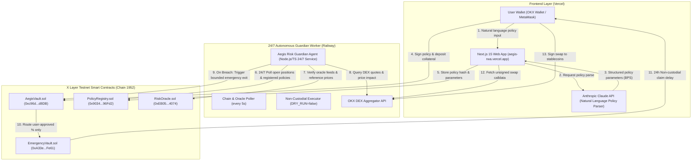

# Aegis — Non-Custodial AI Risk Guardian

> Autonomous risk protection for tokenized real-world assets (RWA) and DeFi positions on **X Layer Testnet (Chain ID 1952)** — open for testing before mainnet launch.

[](https://aegis-rwa.vercel.app)
[-6c6c6c?style=for-the-badge&logo=ethereum)](https://www.oklink.com/x-layer-testnet)
[](https://soliditylang.org/)
[](https://getfoundry.sh/)
[](https://nextjs.org/)

---

## 🛡️ Overview

Aegis allows users to deposit supported tokenized real-world assets (such as **GLDX** tokenized gold, **SPYX** tokenized S&P 500, or **USDC**) into an `AegisVault` position and define custom risk parameters in plain English:

> *"If SPYX drops more than 8% in 24 hours or oracle deviation exceeds 2%, exit 75% to USDC cautiously."*

An AI model parses plain English statements into explicit, immutable on-chain policy parameters. Once signed by the user, the off-chain **Aegis Risk Guardian** continuously monitors live market prices and DEX quotes against the registered policy parameters. If a policy breach occurs, the agent automatically executes bounded de-risking actions within strict parameters pre-authorized by the user.

---

## 📐 System Architecture



### ☁️ Infrastructure: Vercel + Railway + X Layer
* **Vercel**: Hosts the **Next.js 15 web application** and serverless `/api/parse-policy` route. It provides the seamless user portal where users deposit assets, compose plain-English risk policies, and claim recovered collateral.
* **Railway**: Hosts the **persistent 24/7 Guardian Agent** background worker. Unlike serverless environments that shut down after requests, Railway keeps the TypeScript monitoring loop running continuously around the clock to ensure zero gaps in position protection.
* **X Layer Testnet (The Shared Bridge)**: Vercel and Railway have no direct private API connection. Instead, **the X Layer blockchain is their shared source of truth**. When a user creates a policy on Vercel, it is signed on-chain; the Railway Guardian detects the new state on-chain, tracks live prices, and executes non-custodial protection transactions directly on-chain.

---

## 🔒 Trust Boundary & Security Model

The core product design strictly separates **autonomous guardian protection** from **user asset custody**:

1. **Autonomous & Provably Bounded**:
   - The off-chain agent can only invoke `pausePosition` or `routeToEmergency(positionId, exitBps)`.
   - `routeToEmergency` takes **no recipient parameter** and **no arbitrary calldata** — funds can strictly move only to the immutable `EmergencyVault`.
   - The exit percentage is strictly clamped by the contract to the maximum `exitPercentBps` authorized in the user's signed policy.
   - Verified by Foundry invariant fuzz test `testFuzz_AgentCannotDrainToArbitraryAddress`.

2. **Self-Custodied Swaps**:
   - Converting recovered collateral into stablecoins is performed directly by the user from the web dashboard.
   - Aegis fetches unsigned calldata from the OKX DEX aggregator; the user's own wallet signs the approval and transaction. Aegis is never the custodian, router, or recipient.

3. **Ungated Withdrawals**:
   - Manual user withdrawals from `AegisVault` are never subject to time-locks. Users can withdraw their positions at any time.

---

## 🛡️ Emergency Vault: Key Benefits & Security Architecture

A primary innovation in Aegis is the **`EmergencyVault.sol`** design. Automated DeFi tools historically struggled with a fundamental dilemma: *How can an automated AI agent react at lightning speed to market crashes without being granted dangerous custody over user funds?*

The Emergency Vault solves this with a **provably non-custodial, time-locked architecture**:

### 1. Zero-Custody AI Agent Execution
- The Guardian agent possesses authority to **de-risk** a position (moving volatile assets into safe escrow when a signed drawdown threshold is breached), but **ZERO authority to withdraw, transfer, or redirect those assets**.
- The `routeToEmergency` function in `AegisVault.sol` hardcodes the destination exclusively to `EmergencyVault.sol` with no custom recipient arguments.

### 2. Immunity to Rogue Agents & Compromised Keys
- If an off-chain agent server or private key is ever compromised, an attacker gains nothing by triggering unauthorized exits. 
- Funds are transferred strictly into escrow assigned to the original position owner's wallet address (`msg.sender == owner`). The agent key cannot drain, redirect, or claim those tokens.

### 3. Flash Loan & Oracle Manipulation Resistance
- In volatile flash crashes or oracle distortions (e.g. temporary DEX liquidity pool manipulation), automated bots that immediately dump tokens to market fall victim to predatory MEV sandwich attacks and selling at the absolute bottom.
- Aegis routes the **original base tokens directly into safety escrow**, preserving the full asset balance without forcing an adverse market sell while liquidity settles.

### 4. Deterministic Non-Custodial Claims
- Only the original depositing wallet has the on-chain cryptographic authority to call `EmergencyVault.claim(positionId, claimIndex)`.
- The 24-hour security window provides a transparent on-chain audit delay, preventing front-running and giving users full visibility and control over their protected capital.

---

## ⛓️ Testnet Smart Contract Deployments (X Layer Testnet, Chain 1952)

All core smart contracts are deployed, active, and **100% source-verified on OKLink Explorer**:

| Contract | Testnet Contract Address | Status | Block Explorer Link |
|---|---|---|---|
| **AegisVault** | `0xc96d34534270B3ff41b5b4e30731c980FdfEd8DB` | Verified ✓ | [OKLink AegisVault](https://www.oklink.com/x-layer-testnet/address/0xc96d34534270B3ff41b5b4e30731c980FdfEd8DB) |
| **EmergencyVault** | `0xA33e3050b185B9289C1732d71C53B0c36A25Fe61` | Verified ✓ | [OKLink EmergencyVault](https://www.oklink.com/x-layer-testnet/address/0xA33e3050b185B9289C1732d71C53B0c36A25Fe61) |
| **PolicyRegistry** | `0x90346e8ebB6fb000c97BbcdE93D7C5C192396Fd2` | Verified ✓ | [OKLink PolicyRegistry](https://www.oklink.com/x-layer-testnet/address/0x90346e8ebB6fb000c97BbcdE93D7C5C192396Fd2) |
| **RiskOracle** | `0xEB0538B1c199eC063B7E6e785572ed4402D94074` | Verified ✓ | [OKLink RiskOracle](https://www.oklink.com/x-layer-testnet/address/0xEB0538B1c199eC063B7E6e785572ed4402D94074) |

### Testnet Mock Assets (free to mint — no real funds needed)
- **tGLDX** (Mock Tokenized Gold): `0xa7218E99738F3d83f6c2B85b2b5f13f6E709a3DF`
- **tSPYX** (Mock Tokenized S&P 500): `0x28AD1826640A3B840bD13e0C0900dE8C75C6491C`
- **tUSDC** (Mock USD Stablecoin): `0x7d2a9f61f641538787ba6052A8C496C749AfBfd1`


### 🚰 Getting Started on Testnet (no real funds needed)

To test Aegis you need two things — both are free:

**1. Testnet OKB (gas):**
> X Layer Testnet uses **OKB** as its gas token. Get **0.2 OKB/day** from the official faucet:
> **[https://web3.okx.com/xlayer/faucet](https://web3.okx.com/xlayer/faucet)**
> Make sure your wallet is connected to **X Layer Testnet (Chain ID 1952)** before requesting — the faucet only drips to addresses on the testnet chain.

**2. Testnet mock tokens (tGLDX / tSPYX / tUSDC):**
### 🧪 How to Test a Live Risk Breach on Testnet

To test the entire autonomous de-risking flow end-to-end:

1. **Mint Tokens & Open Position**: Mint `tSPYX` from the **Faucet** tab on [aegis-rwa.vercel.app/app](https://aegis-rwa.vercel.app/app) and deposit a new position in the **Positions** tab.
2. **Sign a Risk Policy**: In the **Policies** tab, sign a policy such as:
   > *"If tSPYX drops more than 8%, move 75% to USDC cautiously."*
3. **Simulate a Market Breach**: Run the testnet price-feed simulator from the project root:
   ```bash
   npx tsx agent/wire_spyx_feed.ts
   # or run the full end-to-end breach trigger:
   npx tsx agent/trigger-user-breach.ts
   ```
4. **Watch the Autonomous Guardian Act**:
   - The 24/7 Railway Guardian Agent detects the price drop on-chain.
   - It automatically executes `routeToEmergency(positionId, 7500)` on `AegisVault.sol`.
   - Your dashboard updates in real-time: an **Emergency Claim Banner** appears on the **Overview** tab, and your protected funds are listed in the **Emergency Claims** tab.

---

### 💡 Why Oracle Updates Are Simulated on Testnet: The Stale Price Guard

In a live production environment on **Mainnet**, Chainlink node networks and live OKX DEX liquidity pools publish fresh market prices automatically every block.

On **Testnet**, mock RWA tokens (`tSPYX`, `tGLDX`) do not have live public trading markets or automated external node runners. 

`RiskOracle.sol` enforces an uncompromising security rule:
```solidity
uint256 public staleAfter = 3600; // 1 hour max age
```
If an oracle feed has not pushed an on-chain update within 1 hour, `getPrice()` reverts with `StalePrice`.

**This is a core design feature of Aegis: The Guardian Agent will NEVER act on a guess or an outdated price.** When a price feed is stale or unconfigured on testnet, the agent safely logs a warning and skips the position rather than triggering false emergency exits. Pushing a price update via `wire_spyx_feed.ts` refreshes the on-chain timestamp, providing the fresh data required for the Guardian to act.

> ⚠️ **Mainnet deployment exists** (Chain 196) but is not yet open for public use. The live app runs on testnet only.

---

## 🗺️ Product Roadmap

### 📍 Phase 1: X Layer Testnet & Core Guardian (Q3 2026 — Live on Testnet ✅)
- [x] Deploy & source-verify smart contracts on X Layer Testnet (Chain 1952).
- [x] Launch natural language LLM policy parser (Anthropic Claude integration).
- [x] Deploy off-chain AI guardian monitoring engine with OKX DEX quote verification.
- [x] Launch web dashboard deployed to Vercel ([aegis-rwa.vercel.app](https://aegis-rwa.vercel.app)).
- [ ] Open public mainnet deployment on X Layer Mainnet (Chain 196).

### 📍 Phase 2: Multi-Asset Expansion & Advanced Risk Engine (Q4 2026)
- [ ] Support additional tokenized Real-World Assets (Tokenized US Treasuries, Commodities, Equities).
- [ ] Explore supplementary price-verification sources for assets with thin DEX liquidity, as a redundancy layer alongside live OKX DEX quotes.
- [ ] Add statistical rolling z-score volatility triggers for proactive position pausing before sharp market drops.
- [ ] Automated user notifications via Telegram / Email webhooks on policy breaches.

### 📍 Phase 3: Cross-Chain Expansion & Enterprise Vaults (Q1 2027)
- [ ] Expand Aegis risk guardian infrastructure to Arbitrum, Base, and OKX Web3 cross-chain bridge routes.
- [ ] Launch Multi-Sig Institutional Vaults with multi-agent consensus approvals for enterprise treasury management.
- [ ] Implement audit trail export and compliance reporting dashboard for institutional funds.

### 📍 Phase 4: Decentralized Agent Mesh & Intent Optimizer (Q2 2027)
- [ ] Transition from single-node agent execution to a decentralized guardian relay network.
- [ ] Introduce Zero-Knowledge (ZK) execution proofs for on-chain breach verification prior to vault de-risking.
- [ ] Intent-driven automated yield & risk hedging strategies across tokenized asset pools.

---

## 📂 Codebase Layout

```
├── src/                  # Solidity Smart Contracts (solc 0.8.33, prague EVM)
│   ├── AegisVault.sol       # Primary vault for position management & agent de-risking
│   ├── EmergencyVault.sol   # Time-locked vault for agent-routed funds
│   ├── PolicyRegistry.sol   # Immutable storage of user-signed risk parameters
│   ├── RiskOracle.sol       # Reference asset valuation registry
│   └── mocks/               # Development mock contracts
├── script/               # Foundry deployment scripts (Mainnet & Testnet)
├── test/                 # Foundry unit tests & non-custodial invariant fuzz tests
├── agent/                # Off-chain AI Guardian Engine (TypeScript)
│   ├── src/policy/          # Natural language policy parser
│   ├── src/risk/            # Volatility & drawdown evaluation engine
│   ├── src/okx/             # OKX DEX REST API quote client
│   └── src/monitor.ts       # Live chain monitoring loop
├── frontend/             # Next.js 15 Web Dashboard
│   ├── app/                 # Next.js App Router pages & API routes (/api/swap, /api/parse-policy)
│   ├── components/          # React components (Policy composer, Margin chart, Risk radar)
│   └── lib/                 # Chain config (xLayerTestnet 1952), Viem clients, wallet helpers
├── scripts/              # Verification, automated testing, & maintenance scripts
└── verify/               # OKLink standard JSON input verification metadata
```

---

## ⚡ Quick Start & Local Setup

### Prerequisites
- [Foundry](https://getfoundry.sh/) (`forge`, `cast`)
- [Node.js](https://nodejs.org/) (v18+) & `npm`

### 1. Build and Test Smart Contracts
```bash
# Compile contracts
forge build

# Run unit tests and invariant fuzzing
forge test -vvv
```

### 2. Run the Off-Chain Risk Guardian Agent
```bash
cd agent
npm install

# Run unit tests
npm test

# Launch monitoring agent (DRY_RUN=true by default for safe evaluation)
npm run dev
```

### 3. Run the Next.js Web Dashboard
```bash
cd frontend
npm install

# Launch dev server on http://localhost:3000
npm run dev
```

---

## 📄 License

Built for the **X Layer / OKX Web3 Ecosystem**. Distributed under the MIT License.
